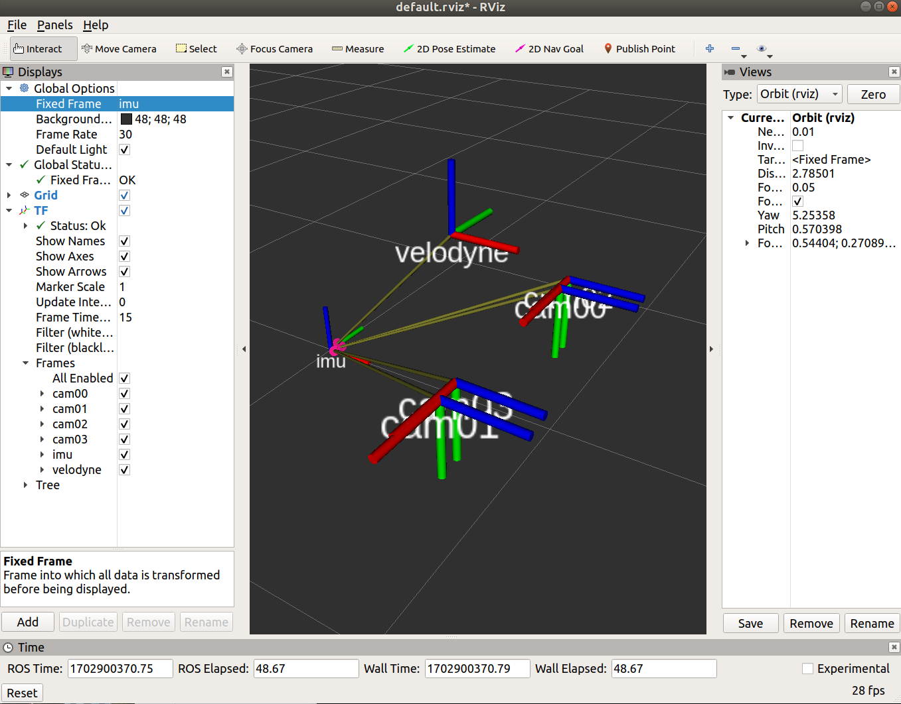

# Calibration TF Publisher

Store your calibration TFs as a yaml file and have this node publish them as statics TFs by loading it from the parameter
server.

Usage:
>  #Load calibration TFs into the param server from default location **(../config/tf.yaml)** and start TFs publisher  
>  #(run this command in launch directory)  
>  roslaunch calibration_configs_loader tf_loader.launch  

Alternatively:
> #Load calibration TFs from config file and publish 
> roslaunch calibration_configs_loader tf_loader.launch tf_file:=/xxx/yyy/zzz/tf.yaml

The TFs will publish in topic: /tf
User can use rviz tf viewer subscribe this topic to view tf information

snapshot of rviz:
